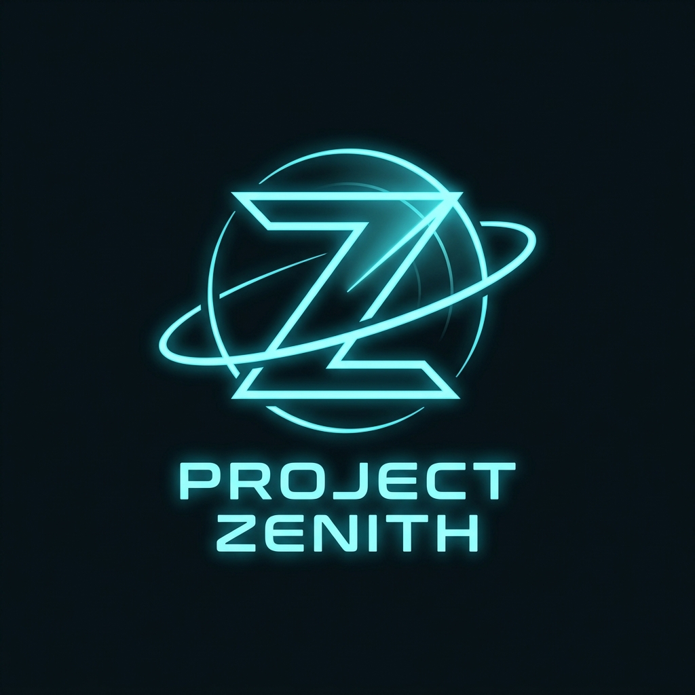

<div align="center">
  
  <h1>Project Zenith : The Celestial Eye</h1>
  <p><strong>An advanced, browser-based 3D orbital mechanics engine, real-time satellite tracker, and deep-space simulator.</strong></p>
</div>

---

## 🌌 Overview

**Project Zenith** is a high-performance, web-based space tracking platform. Designed with an ultra-premium, dark-mode glassmorphic interface, it allows users to track real-time satellite trajectories, explore a mathematically accurate 3D Solar System, and interact with hidden celestial physics simulations.

Built on the cutting edge of Next.js 16, Three.js, and WebGL, Zenith processes complex SGP4 orbital propagation mathematics directly in the browser to deliver a seamless 60 FPS experience.

---

## ✨ Comprehensive Feature List

### 📡 1. The Global Radar System (`/radar`)
The heart of Zenith is the real-time satellite tracking globe.
*   **Holographic 3D Earth:** Powered by `react-globe.gl`, featuring high-resolution satellite imagery, topographic bump-mapping, day/night atmospheric cycles, and a custom glowing cloud layer.
*   **Real-Time Orbital Math:** Uses `satellite.js` (SGP4 propagation) to instantly calculate the exact Latitude, Longitude, and Altitude of active satellites using live TLE (Two-Line Element) data.
*   **Multi-Constellation Tracking:** Simultaneously renders orbits for the International Space Station (ISS), Starlink networks, the Hubble Space Telescope, and designated orbital debris.
*   **User Localization:** Requests browser GPS coordinates to plot your exact location on the 3D globe with a glowing beacon.
*   **Sky Visibility Engine:** Mathematically calculates the horizon angle between your house and a satellite to tell you if the object is currently visible in your night sky.
*   **Zenith Time Machine:** Advanced time-controls allowing you to fast-forward or rewind time to predict where a satellite will be in the future.
*   **Live Camera Feed Simulation:** A high-tech UI panel that simulates a noisy, static-filled video feed from the target satellite.
*   **Sci-Fi Lore & Anomaly Logs:** Immersive UI panels displaying categorized space debris warnings and deep-space anomalies.

### 🪐 2. Deep Space Solar System Viewer (`/solar-system`)
A macroscopic view of our cosmic neighborhood.
*   **Accurate Planetary Scale & Orbits:** A massive Three.js scene containing Mercury, Venus, Earth, Mars, Jupiter, Saturn, Uranus, and Neptune. Each planet rotates at accurate relative speeds and features realistic HD textures.
*   **Dynamic Asteroid Belt:** Procedurally generated thousands of asteroids orbiting between Mars and Jupiter.
*   **Deep Space Missions:** Track the real-time estimated positions of Voyager 1, the James Webb Space Telescope (JWST), and the Perseverance Rover.
*   **Ride Mode:** Lock the camera to any planet or probe and ride alongside it as it journeys around the Sun.
*   **Cosmic Time Manipulation:** Accelerate the universe to watch planetary alignments happen in seconds.

### 🕳️ 3. The Singularity & Black Hole Mini-Game (`/black-hole`)
A hidden, interactive physics simulation.
*   **Supermassive Black Hole:** A stunning, shaders-based 3D black hole featuring extreme gravitational lensing, a glowing accretion disk, and an event horizon.
*   **Newtonian Physics:** If you fly too close, the gravity well will consume you. If you fly too fast, you will be lost to the void. Features high-score tracking for survival time.

### 🖥️ 4. The Zenith Command Center (Homepage)
A beautifully crafted command dashboard.
*   **Interactive Terminal:** A fully typing, responsive command-line interface.
*   **Zero-G Hangman (Anomaly Decryptor):** A fully playable mini-game integrated into the dashboard where users must guess space-themed words before the system locks them out.
*   **Live Launch Data:** A futuristic ticker displaying upcoming global rocket launches.
*   **Sci-Fi Diary:** A classified logbook detailing the lore and discoveries of the Zenith project.

---

## 🛠️ Technical Stack & Architecture

*   **Core Framework:** Next.js 16 (App Router)
*   **Language:** TypeScript
*   **Styling:** Tailwind CSS v4 + Vanilla CSS (Custom Glassmorphism & Neon Glow Tokens)
*   **3D Rendering Engine:** 
    *   `three.js` (Core WebGL)
    *   `@react-three/fiber` (React bindings for Three.js)
    *   `@react-three/drei` (Advanced 3D helpers and controls)
    *   `react-globe.gl` (Geospatial data visualization)
*   **Orbital Mathematics:** `satellite.js` (WASM-accelerated SGP4 propagation)
*   **State Management:** `Zustand` (Global radar state, time-offsets, and user location)
*   **Animations:** `framer-motion` (Micro-interactions and panel sliding)
*   **Icons:** `lucide-react`
*   **Deployment & Analytics:** Vercel

---

## ⚙️ Advanced Webpack Configuration

Due to the intense mathematical requirements of the orbital engine, `satellite.js` utilizes WebAssembly (`em-pthread`) to calculate trajectories. Next.js 16's default `Turbopack` engine currently deadlocks when compiling massive WASM binary threads. 

To achieve a successful production build, Project Zenith utilizes a highly customized Webpack override in `next.config.ts`:
1.  **Forced Webpack Engine:** Completely bypasses Turbopack.
2.  **Node:Scheme Polyfills:** Uses `NormalModuleReplacementPlugin` to strip illegal `node:worker_threads` requests during client-side bundling, mapping them to empty modules to prevent `UnhandledSchemeError` crashes.
3.  **Transpile Packages:** Forces Next.js to transpile `three` and `@react-three` to prevent barrel-export memory leaks.

---

## 🚀 Running Locally

1. **Clone the repository:**
   ```bash
   git clone https://github.com/02-rfq-07/Zenith.git
   cd Zenith
   ```

2. **Install dependencies:**
   ```bash
   npm install
   ```

3. **Run the development server:**
   ```bash
   npm run dev
   ```

4. **Access the application:**
   Open [http://localhost:3000](http://localhost:3000) in your browser.

---

<div align="center">
  <p><i>"The universe is under no obligation to make sense to you. But Zenith will try."</i></p>
</div>
